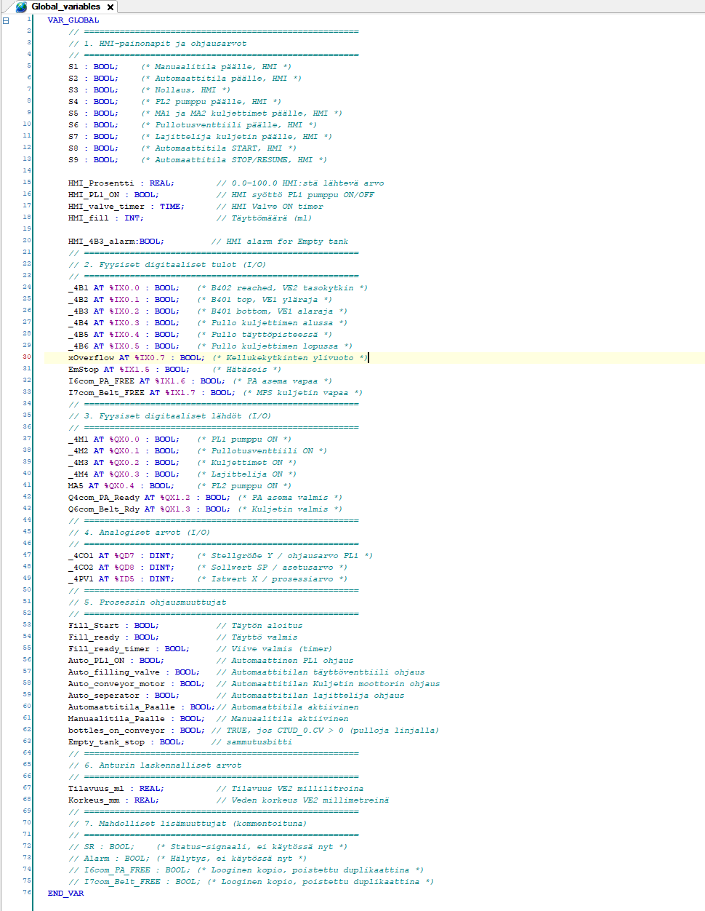

# CodeSys Automation Project

> **Suomeksi lyhyesti:**  
> Tämä repositorio sisältää CodeSys (IEC 61131‑3) ‑projektin, jossa on automaatti- ja manuaalitilat, turvalogiikka, venttiilin/pumpun/kuljettimen ohjaus sekä analoginen moottoriohjaus. README esittelee rakenteen, kuvat ja tärkeimmät ohjelmalohkot työnhakua varten.

---

## Overview

This repository contains a **CodeSys V3** automation project demonstrating:
- A clean split between **Automatic** and **Manual** modes
- Safety handling (**ESTOP**, interlocks)
- **Analog motor control** with scaling and limits
- Modular **FBD/LD/ST** POUs (function blocks)
- Clear global variable design and task configuration

The goal is to show professional PLC programming practices: modular blocks, readable logic, and maintainable structure.

---

## Repository Structure
src/    → Exported/openable CodeSys project (*.export or *.project)
docs/   → Screenshots of logic blocks, device tree, variables, etc.
README.md

---

## How to Open the Project

**A) Import the exported project**
1. Open **CODESYS V3.x**  
2. Project → Import → Project…  
3. Select the file in `src/` (e.g., `src/CodeSys-projekti.export`)  
4. Assign your target controller and I/O as needed

**B) Open the project file**
1. File → Open Project…  
2. Select `src/CodeSys-projekti.project` (if present)  
3. Assign target/I/O if necessary

> Note: Device specifics (IPs, runtime) are not included; map to your environment.

---

## Quick Gallery

**Device tree**  
docs/device_tree.png

**Global variables**  
docs/Global_variables.png

**Main program (PLC_PRG) – overview**  
docs/PLC_PRG1.png

**Main program (PLC_PRG) – FB instances**  
docs/PLC_PRG2.png

---

## Logic Overview

### 🔵 Automatic Mode (LD)
Automatic mode is latched with an RS flip‑flop and released by reset or safety conditions.  
Output signal `Automaattitila_paalle` is the global enable for all automatic sub‑blocks.

docs/LD_Automaattitila.png

**Key idea**
- **SET (start)** from operator inputs (e.g., S1/S2/S3)  
- **RESET** from stop conditions or ESTOP  
- Drives `Automaattitila_paalle` used across the project

---

### 🧰 Manual Mode (LD)
Manual ladder logic gates each actuator output with `Manuaalitila_paalle` and **ESTOP** so that manual jog/testing is safe and controlled.

docs/LD_Manuaali_logiikka.png

Highlights:
- Each actuator rung = `Manuaalitila_paalle AND NOT ESTOP`  
- Clear separation from automatic outputs  
- Immediate cut‑off on ESTOP

---

### ⚙️ Automatic Output Control (FBD)
In automatic mode, the main actuators are enabled only when `Automaattitila_paalle = TRUE`.  
Simple AND gating prevents unintended actuation.

docs/FBD_Auto_output_control.png

Controls:
- `Auto_filling_valve` → `_4M2`  
- `Auto_conveyor_motor` → `_4M3`  
- `Auto_separator`      → `_4M4`

---

### 🚦 Automatic Conveyor Valve Control (FBD)
Combines sensor feedback, interlocks, and state conditions to allow or inhibit the conveyor valve.

**Logic overview**  
docs/FBD_Auto_conveyor_valve_1.png

**Internal variables & timing (TON/TOF, R_TRIG/F_TRIG)**  
docs/FBD_Auto_conveyor_valve_2.png

Key points:
- Edge detection and comparators to form robust conditions  
- Timers for debouncing and hold times  
- Clear separation of safety vs. process logic

---

### 💧 Automatic Pump Control (FBD)
Pump logic uses a ready‑delay (TON) and SR/RS latches to keep the pump stable and safe.

docs/FBD_Auto_pump_on.png

Highlights:
- `Fill_ready` & auto mode start a delay  
- SR latch enables pump after delay  
- RS latch and safety inputs (ESTOP, S0/S1) reset

---

### 🔧 Analog Motor Control (FBD)
Scales and clamps analog output; supports manual/automatic selection and safety interlocks.

docs/FBD_analog_motor_control.png

Highlights:
- `SEL` for manual/auto source selection  
- `MUL` + `REAL_TO_INT` for scaling  
- `LIMIT` to clamp AO before output

---

## Data Manipulation (ST)

This ST block converts a raw level sensor value into **volume (ml)** and **height (mm)**, clamps HMI parameters on start, provides a snapshot‑based fill reference, and implements a small safety routine: if the tank becomes empty (with hysteresis) and the conveyor is clear, it issues a one‑cycle stop pulse and leaves auto mode after a 5‑second verification.

**Core snippet:**
```st
FUNCTION_BLOCK ST_Data_manipulation
VAR CONSTANT
    MinArvo     : DINT := 5000;      // Sensor min (empty)
    MaxArvo     : DINT := 9630000;   // Sensor max (full)
    TilavuusMax : REAL := 3390.0;    // Tank volume [ml]
    KorkeusMax  : REAL := 220.0;     // Tank height [mm]
END_VAR
VAR
    Snapshot        : REAL;          // Target volume (captured on S8)
    RajoitettuArvo  : DINT;          // Clamped sensor value
    had_water_since_start : BOOL := FALSE;
    empty_state           : BOOL := FALSE;
    EmptyThreshold_ml     : REAL := 10.0;
    NotEmptyThreshold_ml  : REAL := 20.0;
    WaterPresenceThreshold_ml : REAL := 50.0;
    tEmpty5s : TON;  rTrig_EmptyOk : R_TRIG;
    allow_stop : BOOL;  timer_in : BOOL;
END_VAR

// Clamp HMI inputs when auto is started (S8)
IF S8 THEN
    IF HMI_fill <= 500 THEN HMI_fill := 500;
    ELSIF HMI_fill > 3000 THEN HMI_fill := 3000; END_IF;
    IF HMI_valve_timer < T#0MS THEN HMI_valve_timer := T#0MS;
    ELSIF HMI_valve_timer > T#2000MS THEN HMI_valve_timer := T#2000MS; END_IF;
END_IF;

// Snapshot on S8 and start/ready conditions
IF S8 THEN Snapshot := Tilavuus_ml + HMI_fill; END_IF;
Fill_start := (HMI_fill >= 500) AND Automaattitila_paalle;
Fill_ready := (Tilavuus_ml >= Snapshot);

// Clamp raw sensor and scale to ml/mm
IF _4PV1 < MinArvo THEN RajoitettuArvo := MinArvo;
ELSIF _4PV1 > MaxArvo THEN RajoitettuArvo := MaxArvo;
ELSE RajoitettuArvo := _4PV1; END_IF;

Tilavuus_ml := ((TO_REAL(RajoitettuArvo) - TO_REAL(MinArvo)) * TilavuusMax)
               / (TO_REAL(MaxArvo) - TO_REAL(MinArvo));
Korkeus_mm  := ((TO_REAL(RajoitettuArvo) - TO_REAL(MinArvo)) * KorkeusMax)
               / (TO_REAL(MaxArvo) - TO_REAL(MinArvo));

// Empty handling with hysteresis + 5s verify; then one‑cycle stop + leave auto
IF Tilavuus_ml >= WaterPresenceThreshold_ml THEN had_water_since_start := TRUE; END_IF;

IF empty_state THEN
    IF Tilavuus_ml >= NotEmptyThreshold_ml THEN empty_state := FALSE; END_IF;
ELSE
    IF Tilavuus_ml <= EmptyThreshold_ml THEN empty_state := TRUE; END_IF;
END_IF;

allow_stop := NOT bottles_on_conveyor;
timer_in   := empty_state AND had_water_since_start AND allow_stop;
tEmpty5s(IN := timer_in, PT := T#5S);
rTrig_EmptyOk(CLK := tEmpty5s.Q);

IF rTrig_EmptyOk.Q THEN
    Empty_tank_stop := TRUE;
    Automaattitila_paalle := FALSE;
ELSE
    Empty_tank_stop := FALSE;
END_IF;

END_FUNCTION_BLOCK
'''
## Global Variables

Global signals are grouped and commented for clarity (levels, thresholds, interlocks, mode bits, AO scaling, etc.).



---

## Tasks & Execution Cycle

Use a cyclic task (e.g., `Task20ms`) to execute `PLC_PRG` and schedule FBs reliably.

> If you have a Task Configuration screenshot, add it to `docs/` and reference it here (e.g., `docs/task_configuration.png`).

---

## What I Learned

- Designing modular PLC applications with multiple POUs (LD/FBD/ST)
- Building clear **Automatic / Manual** mode separation with shared enables
- Implementing **safety interlocks** and ESTOP handling
- Scaling and limiting **analog outputs** safely
- Using **edge detection** and **timers** to stabilize sequences
- Maintaining readable **global variables** and naming conventions
